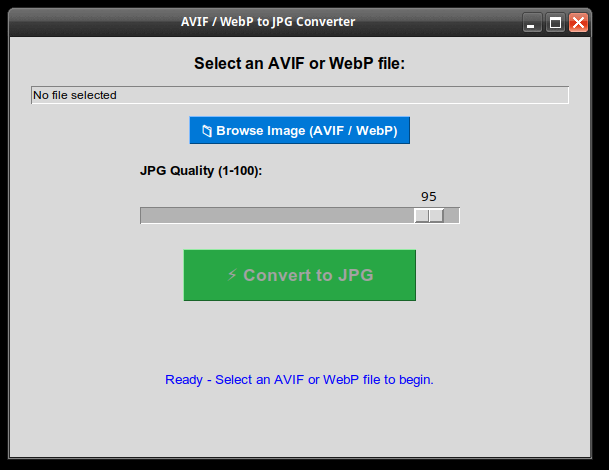

## AVIF & WebP to JPG Converter (Single Image GUI)

A simple Python GUI tool that converts single AVIF or WebP images to JPG with a quality slider. Built with Tkinter and Pillow, using native system decoders for AVIF processing without requiring Python virtual environments or extra pip plugins.



## Features
- Convert `.avif` / `.AVIF` and `.webp` / `.WEBP` images to `.jpg`
- Uses native system tools (`libavif-bin` or `ffmpeg`) for lightweight AVIF decoding
- Adjustable JPG quality (1–100, default 95)
- Saves output in the same directory as the original file
- Handles transparency (RGBA → RGB white background flattening)
- Optimized JPG output
- Clear success/error status display

## Requirements
- Python 3.8+
- Pillow (`python3-pil`)
- `libavif-bin` (or `ffmpeg`) for AVIF decoding

## Installation (Debian / Ubuntu / Xubuntu)
Install the required (and ffmpeg if needed) system tools directly via APT (on older system use pip to install Python tools):

```bash
sudo apt update && sudo apt install -y python3-pil libavif-bin
